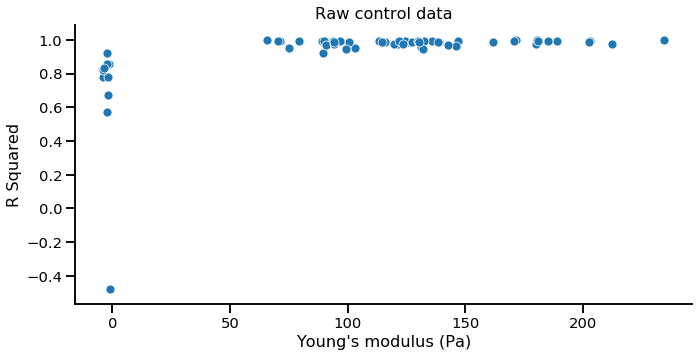
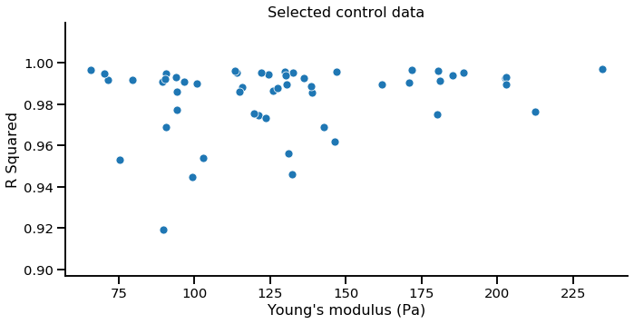
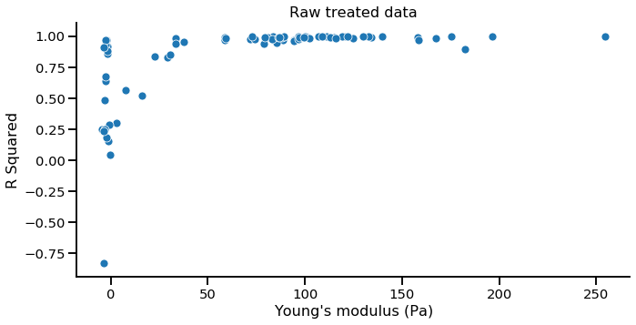
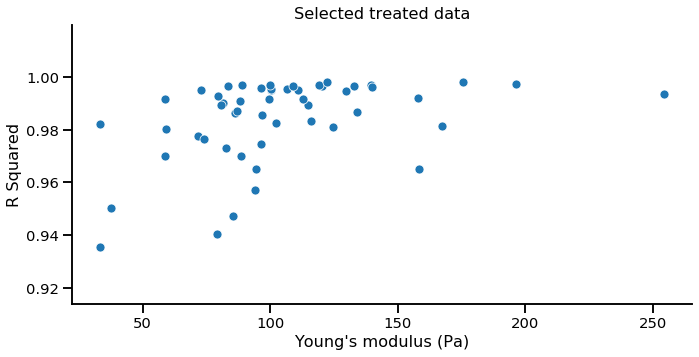
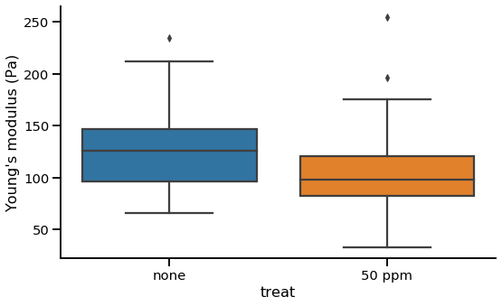
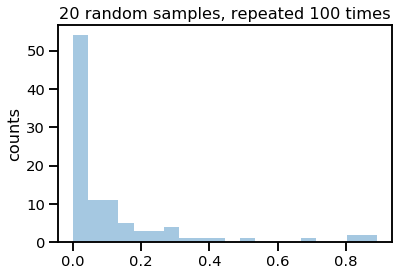
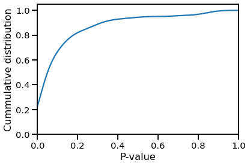

# Jupyter notebook to process the data


```python
from IPython.display import HTML

HTML('''<script>
code_show=true; 
function code_toggle() {
 if (code_show){
 $('div.input').hide();
 } else {
 $('div.input').show();
 }
 code_show = !code_show
} 
$( document ).ready(code_toggle);
</script>
<form action="javascript:code_toggle()"><input type="submit" value="Click here to toggle on/off the raw code."></form>''')
```


<script>
code_show=true; 
function code_toggle() {
 if (code_show){
 $('div.input').hide();
 } else {
 $('div.input').show();
 }
 code_show = !code_show
} 
$( document ).ready(code_toggle);
</script>
<form action="javascript:code_toggle()"><input type="submit" value="Click here to toggle on/off the raw code."></form>


```python
import pandas as pd; import numpy as np; 
import seaborn as sns; sns.set_context('talk', font_scale=.9)
import matplotlib.pyplot as plt
import warnings; warnings.filterwarnings('ignore')
from scipy.stats import ttest_ind
```

## Get the raw data


```python
control_raw = pd.read_csv('control-results.tsv', sep='\t')
treated_raw = pd.read_csv('50ppm-results.tsv', sep='\t')
```


```python
control_raw.loc[:,['Young\'s modulus (Pa)','R Squared']].describe().T
```


<div>
<style scoped>
    .dataframe tbody tr th:only-of-type {
        vertical-align: middle;
    }

    .dataframe tbody tr th {
        vertical-align: top;
    }

    .dataframe thead th {
        text-align: right;
    }
</style>
<table border="1" class="dataframe">
  <thead>
    <tr style="text-align: right;">
      <th></th>
      <th>count</th>
      <th>mean</th>
      <th>std</th>
      <th>min</th>
      <th>25%</th>
      <th>50%</th>
      <th>75%</th>
      <th>max</th>
    </tr>
  </thead>
  <tbody>
    <tr>
      <th>Young's modulus (Pa)</th>
      <td>63.0</td>
      <td>109.556557</td>
      <td>61.657542</td>
      <td>-3.9702</td>
      <td>89.41275</td>
      <td>119.6419</td>
      <td>140.6947</td>
      <td>234.5810</td>
    </tr>
    <tr>
      <th>R Squared</th>
      <td>63.0</td>
      <td>0.932379</td>
      <td>0.197514</td>
      <td>-0.4768</td>
      <td>0.95890</td>
      <td>0.9885</td>
      <td>0.9935</td>
      <td>0.9971</td>
    </tr>
  </tbody>
</table>
</div>


```python
treated_raw.loc[:,['Young\'s modulus (Pa)','R Squared']].describe().T
```


<div>
<style scoped>
    .dataframe tbody tr th:only-of-type {
        vertical-align: middle;
    }

    .dataframe tbody tr th {
        vertical-align: top;
    }

    .dataframe thead th {
        text-align: right;
    }
</style>
<table border="1" class="dataframe">
  <thead>
    <tr style="text-align: right;">
      <th></th>
      <th>count</th>
      <th>mean</th>
      <th>std</th>
      <th>min</th>
      <th>25%</th>
      <th>50%</th>
      <th>75%</th>
      <th>max</th>
    </tr>
  </thead>
  <tbody>
    <tr>
      <th>Young's modulus (Pa)</th>
      <td>78.0</td>
      <td>72.784323</td>
      <td>59.451879</td>
      <td>-4.6358</td>
      <td>3.885550</td>
      <td>83.1796</td>
      <td>110.4565</td>
      <td>254.2959</td>
    </tr>
    <tr>
      <th>R Squared</th>
      <td>78.0</td>
      <td>0.841868</td>
      <td>0.313034</td>
      <td>-0.8340</td>
      <td>0.896425</td>
      <td>0.9789</td>
      <td>0.9935</td>
      <td>0.9982</td>
    </tr>
  </tbody>
</table>
</div>


***The data needs to be cleaned***

It comes from bulk processing of force curves, and some of them are not valid curves.

## Cleaning the data

We know Young's modulus can not be negative. We can also use the R squared to filter good fittings.


```python
sns.relplot(data = control_raw, x = 'Young\'s modulus (Pa)', y = 'R Squared', aspect = 2)
plt.title('Raw control data')
plt.show()
```





Some curves were fitted wit negative $E$ or $R^2$. In this case, we can get rid of the poorly fitted curves by selecting only the curves with $E$ < 50 Pa.


```python
control = control_raw[control_raw['Young\'s modulus (Pa)'] > 50]
sns.relplot(data = control, x = 'Young\'s modulus (Pa)', y = 'R Squared', aspect = 2)
plt.title('Selected control data')
plt.show()
```





```python
sns.relplot(data = treated_raw, x = 'Young\'s modulus (Pa)', y = 'R Squared', aspect = 2)
plt.title('Raw treated data')
plt.show()
```





For the treated cells, we need a different criteria. Some values below 50 Pa had a fairly good $R^2$. 
Then, the criteria can be $E$ > 10, $R^2$ > 0.8


```python
treated = treated_raw[(treated_raw['Young\'s modulus (Pa)'] > 0) & (treated_raw['R Squared']>.9)]
sns.relplot(data = treated, x = 'Young\'s modulus (Pa)', y = 'R Squared', aspect = 2)
plt.title('Selected treated data')
plt.show()
```





## Create a dataframe with $E$ values only


```python
control['treat'] = 'none'
treated['treat'] = '50 ppm'

df = control.append(treated)

sns.catplot(data = df, x= 'treat' , y = 'Young\'s modulus (Pa)', aspect = 1.6,  kind='box')
plt.show()
```





***Non-treated info***


```python
control.loc[:,['Young\'s modulus (Pa)','R Squared']].describe().T
```


<div>
<style scoped>
    .dataframe tbody tr th:only-of-type {
        vertical-align: middle;
    }

    .dataframe tbody tr th {
        vertical-align: top;
    }

    .dataframe thead th {
        text-align: right;
    }
</style>
<table border="1" class="dataframe">
  <thead>
    <tr style="text-align: right;">
      <th></th>
      <th>count</th>
      <th>mean</th>
      <th>std</th>
      <th>min</th>
      <th>25%</th>
      <th>50%</th>
      <th>75%</th>
      <th>max</th>
    </tr>
  </thead>
  <tbody>
    <tr>
      <th>Young's modulus (Pa)</th>
      <td>53.0</td>
      <td>130.687608</td>
      <td>40.809077</td>
      <td>65.7099</td>
      <td>96.6275</td>
      <td>125.8422</td>
      <td>146.8337</td>
      <td>234.5810</td>
    </tr>
    <tr>
      <th>R Squared</th>
      <td>53.0</td>
      <td>0.983619</td>
      <td>0.016545</td>
      <td>0.9192</td>
      <td>0.9763</td>
      <td>0.9905</td>
      <td>0.9943</td>
      <td>0.9971</td>
    </tr>
  </tbody>
</table>
</div>


***50 ppm treated info***


```python
treated.loc[:,['Young\'s modulus (Pa)','R Squared']].describe().T
```


<div>
<style scoped>
    .dataframe tbody tr th:only-of-type {
        vertical-align: middle;
    }

    .dataframe tbody tr th {
        vertical-align: top;
    }

    .dataframe thead th {
        text-align: right;
    }
</style>
<table border="1" class="dataframe">
  <thead>
    <tr style="text-align: right;">
      <th></th>
      <th>count</th>
      <th>mean</th>
      <th>std</th>
      <th>min</th>
      <th>25%</th>
      <th>50%</th>
      <th>75%</th>
      <th>max</th>
    </tr>
  </thead>
  <tbody>
    <tr>
      <th>Young's modulus (Pa)</th>
      <td>52.0</td>
      <td>104.508069</td>
      <td>39.936009</td>
      <td>33.2966</td>
      <td>82.512575</td>
      <td>98.28985</td>
      <td>120.74525</td>
      <td>254.2959</td>
    </tr>
    <tr>
      <th>R Squared</th>
      <td>52.0</td>
      <td>0.984337</td>
      <td>0.015634</td>
      <td>0.9354</td>
      <td>0.979600</td>
      <td>0.99070</td>
      <td>0.99575</td>
      <td>0.9982</td>
    </tr>
  </tbody>
</table>
</div>


***It seems the cells exposed to nanoparticles are softer***. 

Are the differences significant?


```python
E_treat = df[df['treat'] == '50 ppm']['Young\'s modulus (Pa)'].values
E_control = df[df['treat'] == 'none']['Young\'s modulus (Pa)'].values
diff, P = ttest_ind(E_treat, E_control)
print('P = {0:3.4f}'.format(P))
```

    P = 0.0012


***$P$ < 0.05, differences are significant.***

# Just for fun...

What if I take random samples of 20 Young's modulus of each population?


```python
n = 20
p = []
for i in range(100):
    np.random.seed(i)
    control_sample = np.random.choice(E_control, size = n)
    treat_sample = np.random.choice(E_treat, size = n)
    diff, P = ttest_ind(treat_sample, control_sample)
    p.append(P)

sns.distplot(p, bins = 20, kde=False) 
plt.title('20 random samples, repeated 100 times')
#plt.xlabel('P-value')
plt.ylabel('counts')
plt.show()

```





```python
kwargs = {'cumulative': True}
sns.distplot(p, hist = False, kde_kws=kwargs) 
plt.ylabel('Cummulative distribution')
plt.xlim(0,1)
plt.xlabel('P-value')
plt.show()
```





**Then, we have P < 0.05 ONLY in $\approx$50 % of the times, for a sample of 20 force curves, randomly selected ***
